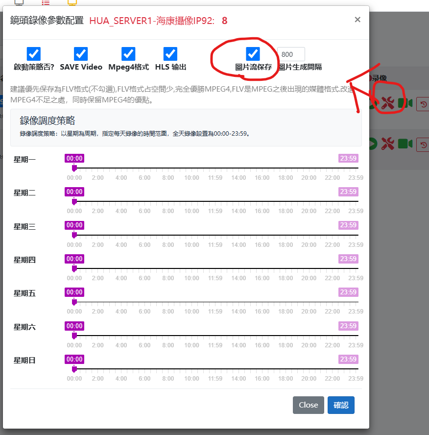
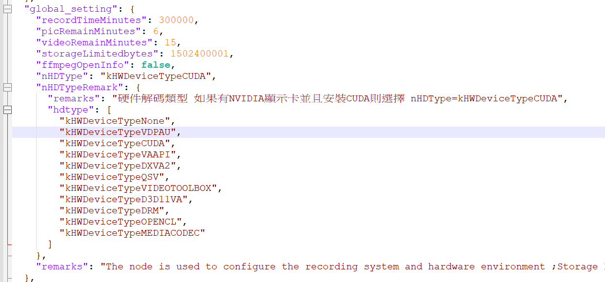
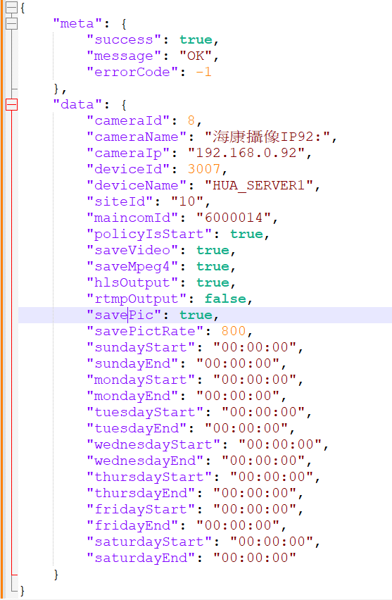

# 保存圖片到硬盤

=================================================================

 

## 保存圖片

注意: 必須在雲端勾選保存圖片或者配置脫機配置文件上

### 脫機設置

如果是脫機設置, 對應的配置文件如下:

#### device.json

#### camera_schedule_8.json

​		CamerId=8 

範例 : 圖片1735800487703.jpg:

要求設置保存圖片
http://192.168.0.128:180/picture/1735800487703.jpg

注意圖片保留時長為:15分鐘

如果清楚掉,則導致無法連接

## 程序邏輯業務所必須

**一般不建議保存到硬盤,除非處理特殊的程序邏輯業務所必須的情況**

​	