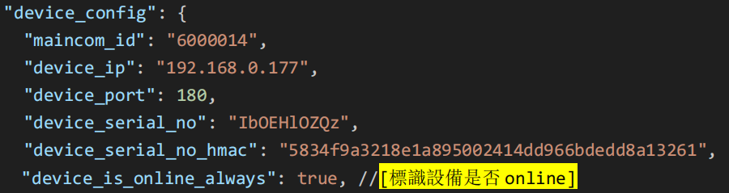

# 脫機配置(無雲端) ./conf

參考詳細的配置文件說明**AI_DEVICE_JSON SETTING MANUAL 設備配置說明-HK.pdf** 

(D:\MediaGuardAppV31\MediaGuard_DOC\AI_DEVICE_JSON SETTING MANUAL 設備配置說明-HK .doc)。

核心思路: 設置脫機,其他./conf/*.json 文件,按照鏡頭多少具體增減鏡頭列表,並且重置rtsp url , rtsp loginId ,rtsp password等。

## **設備配置 device.json**

​					   **設置脫機**

## 配置 camera_schedule_8.json

​	格式: camera_schedule_{cameraId}.json 所有的DeviceId,CameraId要一直即可。

​	

## 配置 camera_tasks_list_8.json

​	格式: camera_tasks_list_{cameraId}.json 所有的DeviceId,CameraId要一直即可。

## 配置 main_company_details_by_serialno.json

​	file: main_company_details_by_serialno.json 所有的DeviceId,CameraId要一直即可。

## SUMARY

以上處於脫機情況的臨時解決方案,如果重新聯機,則需要按照雲端的配置流程重新配置。