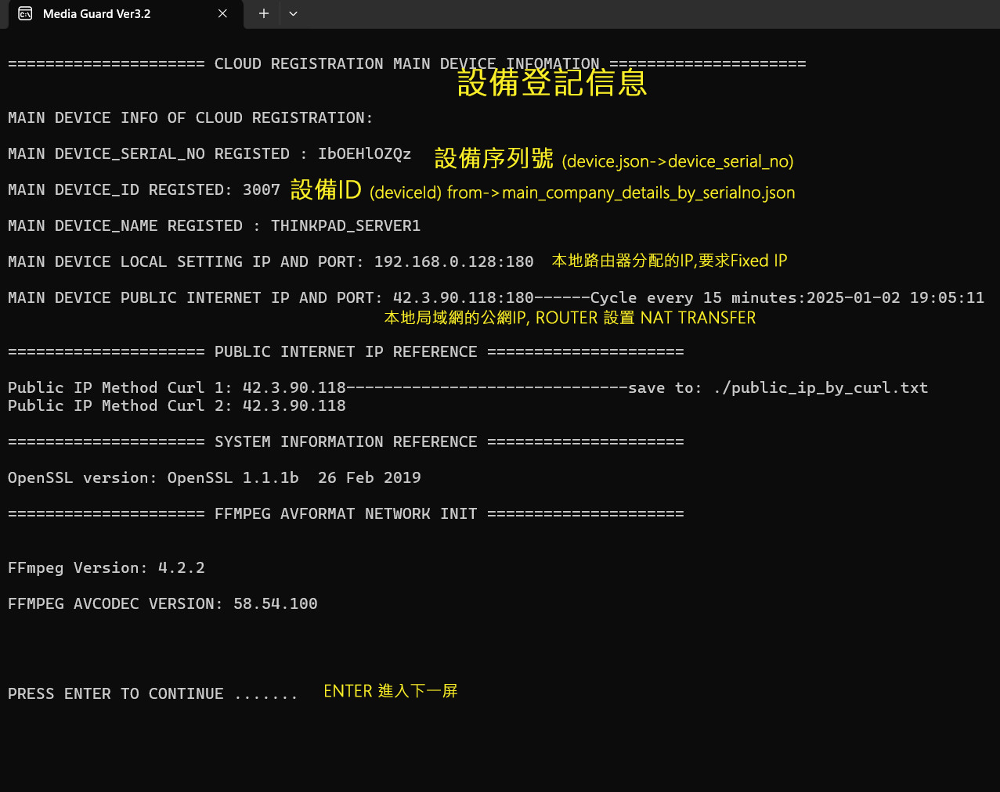
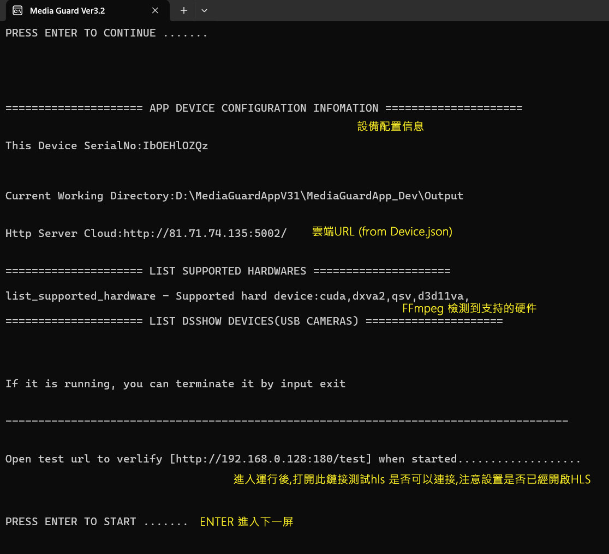
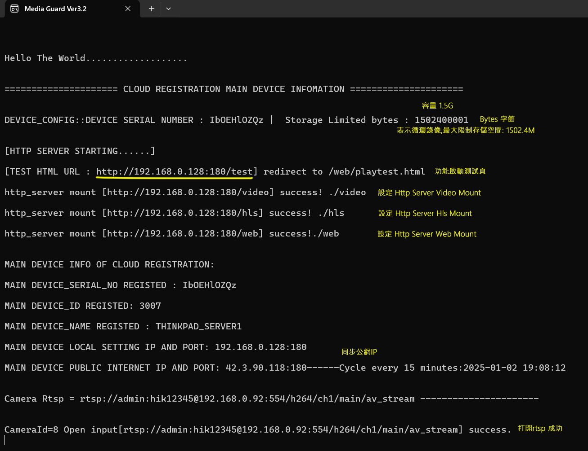
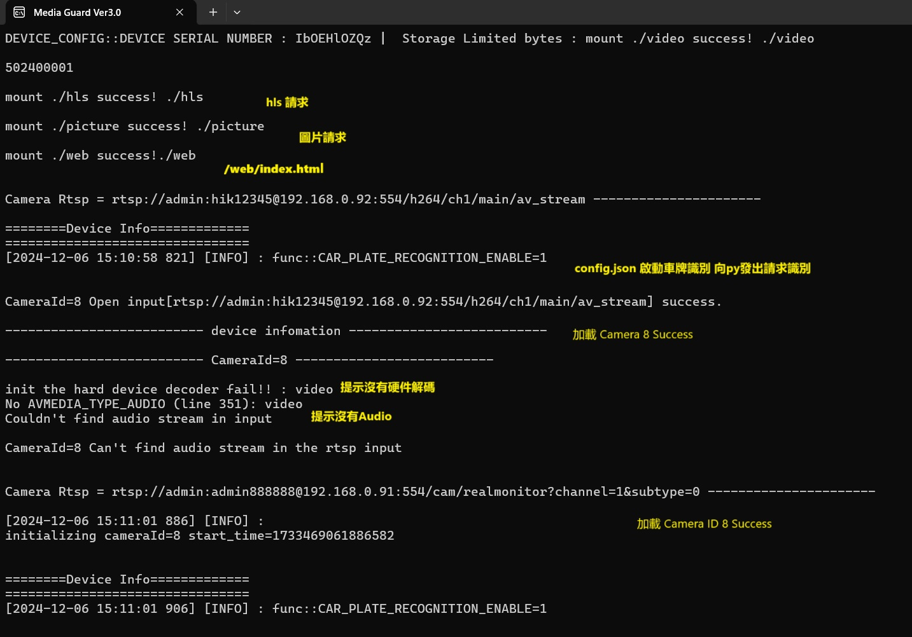

# MediaGuardV32 運行界面說明

## 第一屏

## 第二屏

## 第三屏

容量Volume 轉換工具 : https://www.omnicalculator.com/conversion/byte-converter

**上述屏幕的容量單位是Bytes, 轉換計算:  1502400001Bytes = 1502.4M**

表示循環錄像,最大限制存儲空間: 1502.4M    建議是2T存儲空間For 2 Camera/1020line ;  2T = 2000000000000 Bytes

## 舊版部分信息

